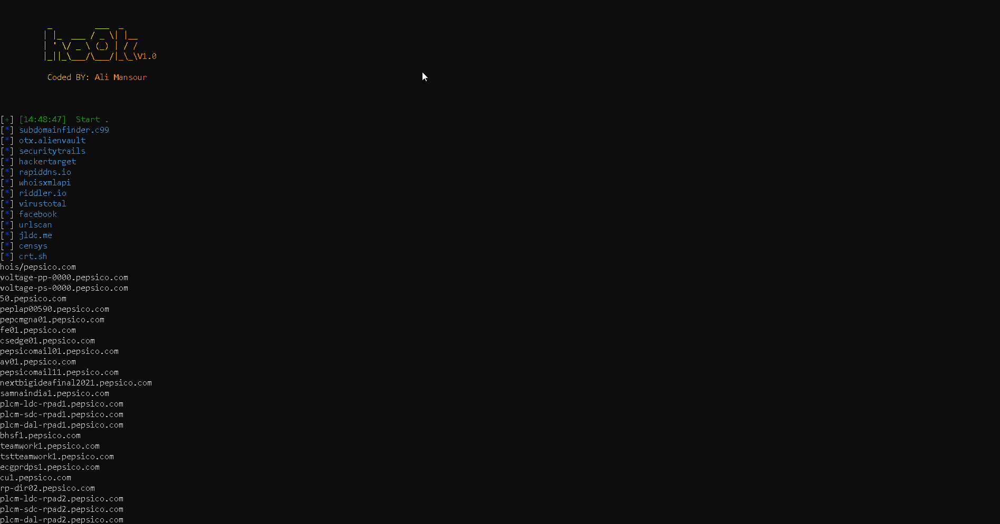

## Table of Content

- [Description](#description)
- [Features](#features)
- [Usage](#usage)
- [Installation](#installation)
- [Contact](#contact)

# Description

`hoOk` is a tool for collecting subdomains from different websites like:

- [https://subdomainfinder.c99.nl/](https://subdomainfinder.c99.nl/)
- [https://rapiddns.io/](https://rapiddns.io/)
- [https://securitytrails.com/](https://api.securitytrails.com/)
- [https://crt.sh/](https://crt.sh/)

And more..

But the unique in tool that is collects all subdomains from `rapiddns.io` from all pages of result.

`Note: whoisxmlapi is limit usage for api so please create more than account and add their apis in whoisxmlapi.txt at the same path of script to make script use one of them every time .`

# Features

<h1 align="left">
  </a>
  <br>
</h1>

# Usage

```console
kali@kali:hoOk$ python3 hoOk.py
Usages:

-t domain to collect subdomains

Example:

1. ./hoOk.py -t hackerone.com # Not https:// or http:// or www.

```

# Installation

```console
git clone https://github.com/mrxdevil404/hoOk.git

cd ./hoOk

chmod +x hoOk.py

python3 hoOk.py -t target.com
```

# Contant

Any Explains : Contact Me: https://www.facebook.com/Error404.0040
